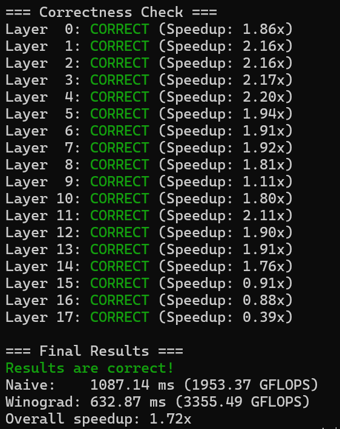

# Final Project 大作业
## 题目一：Winograd 卷积优化

### 1 算法介绍 
Winograd算法是一种高效计算卷积的算法，由Shmuel Winograd于1980年提出。它通过巧妙地变换输入和滤波器数据，用更多的加法操作来替代部分乘法操作，从而显著减少计算量。在深度学习中，该算法尤其适用于小尺寸卷积核（如3x3）的卷积计算，被广泛应用于CNN推理加速。
与传统直接卷积相比，Winograd在相同计算精度下可以显著降低乘法的计算复杂度，显著提升GPU、FPGA等硬件上的计算效率，已成为众多深度学习框架（如TensorFlow、PyTorch）的底层优化技术之一。
深度学习中最常用的 Winograd 变体是 F(2x2, 3x3) 算法，这也是本实验所使用的。该算法用于计算一个 4x4 的输入块与一个 3x3 卷积核的卷积，最终得到一个 2x2 的输出块。

##### 算法流程
记 4x4 输入块为矩阵 $\mathbf D$，3x3 卷积核为矩阵 $\mathbf K$，2x2 输出块为矩阵 $\mathbf R$。
1. 变换输入矩阵 $\mathbf V = \mathbf B^T \cdot \mathbf D \cdot \mathbf B$，其中 $\mathbf B$ 是确定的 4x4 矩阵；
2. 变换卷积核 $\mathbf U = \mathbf G \cdot \mathbf K \cdot \mathbf G^T$，其中 $\mathbf G$ 是确定的 4x3 矩阵；
3. 将变换后的输入 $\mathbf V$ 和变换后的卷积核 $\mathbf U$ 进行逐元素相乘 $\mathbf M = \mathbf V \circ \mathbf U$
4. 对相乘结果 M 进行逆变换 $\mathbf R = \mathbf A^T \cdot \mathbf M \cdot \mathbf A$，其中 $\mathbf A$ 是确定的 4x2 矩阵。

由于矩阵 $\mathbf B,\mathbf G,\mathbf A$ 在最终代码中并未直接体现，此处给出所用的矩阵：
```
B[4][4] = {
    {1, 0, 0, 0}, 
    {0, 1, -1, 1}, 
    {-1, 1, 1, 0}, 
    {0, 0, 0, -1}
};
G[4][3] = {
    {1.0, 0.0, 0.0}, 
    {0.5, 0.5, 0.5}, 
    {0.5, -0.5, 0.5}, 
    {0.0, 0.0, 1.0}
};
A[4][2] = {
    {1, 0}, 
    {1, 1}, 
    {1, -1}, 
    {0, -1}
};
```

### 2 优化思路 - GPU 平台
- Winograd 算法
  使用 Winograd 算法相比乘积累加的朴素算法有明显性能提升，此处不再赘述。
- 内核函数参数
  因为使用的是 F(2x2, 3x3)，所以每个线程独立计算 2x2 的输出小块，各个批 `N`、输出通道 `K` 分开计算；添加了共享内存的声明。
  ```
  线程块: dim3(N * K, ceil((outH / 2) * (outW / 2) / 256), 1)
  线程: dim3(256, 1, 1)
  共享内存: C * 16 * sizeof(float)
  ```
  `blockIdx.x` 决定输入的批 `n` 和通道 `k`，拥有相同 `blockIdx.x` 的线程处理同一组输入，`blockIdx.y` 和 `threadIdx.x` 共同决定线程处理的具体小块位置，共 `(outH / 2) * (outW / 2)` 个。
- 共享内存
  共享内存用于存放提前做过变换的卷积核，以便计算中快速取用。
  理论上，输入张量也可以用共享内存存储，但是这样效率低，这是因为每个线程只需 4x4 的输入块来计算 2x2 的输出块，即输入块间步长为2，也就是说每个输入数据最多被使用2次，复用程度低。
- 手写展开式
  在正式开始计算前，同一线程块的线程共同变换卷积核，输入变换、输出变换由单个线程做相同的处理。由于变换矩阵固定且较小，所以能直接使用展开的硬编码公式，这样能最大程度上简化计算过程。

### 3 运行结果

各输入的具体运行时间见同目录下 run.out 文件。

### 4 结果分析
程序运行时间和申请到的节点似乎有关，有几十到一百多毫秒的差距，不过加速比都在 1.7x 左右。
注意到若干 Layer 的运行结果加速比较其他更低，甚至低于1.00x。查看 config.txt 文件分析输入配置，猜测这是因为输入张量的尺寸偏小导致。
基准代码是普通的乘积累加算法，每个线程只需处理1个结果；而Winograd F(2x2, 3x3)算法中每个线程需要处理 2*2=4 个结果。如果输入张量足够大，所有线程都会被充分使用，这样优化效果就非常明显。但如果输入张量小的话，线程利用率低，基准版本使用的线程数约是优化版本的4倍，不考虑优化的加速比仅有 0.25x，这种情况下反而会降低运行速度。